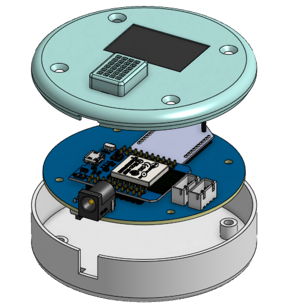

# Wireless Sensor Network with DigiMesh Protocol

  

## Overview

This project demonstrates a **wireless sensor network** using the **DigiMesh protocol** for communication between lab nodes and a **Base Station**. The Base Station collects data from the nodes and publishes it to a cloud server via **MQTT**, enabling real-time monitoring and control through **Node-RED dashboards**.

The system is designed to be **reliable and scalable**, making it ideal for use in lab environments where continuous data collection and monitoring are essential.

## Features

- **DigiMesh Protocol** for reliable mesh network communication between nodes and base station
- **MQTT** for cloud-based data publishing and remote monitoring
- **Node-RED** for real-time data visualization and control via customizable dashboards
- **Scalable**: Add more nodes to expand the network as needed
- **Reliable**: Ensures continuous communication even in large lab environments with multiple sensor nodes